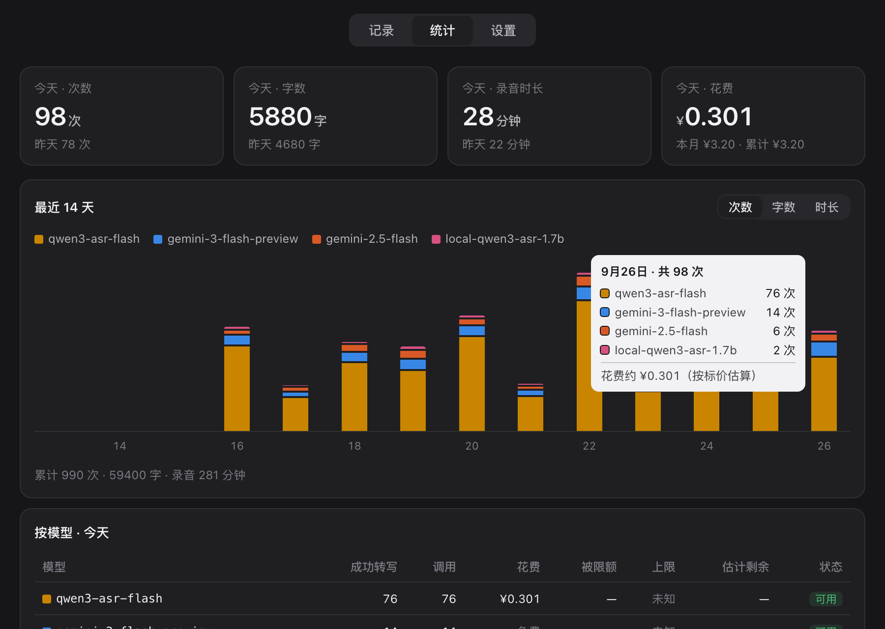

<h1 align="center">voice-input</h1>

<p align="center">
  <b>在 Mac 上按一下键说中文，说完文字就出现在光标处。</b><br>
  给说话中英夹杂的人做的语音输入：写代码、和 Claude Code / ChatGPT 对话、回消息都能用。
</p>

<p align="center">
  <a href="LICENSE"></a>
  
  
</p>

<p align="center">
  <a href="README.md">English</a> · <b>简体中文</b>
</p>

<p align="center">
  
</p>

## 为什么做这个

中文里夹着的英文技术词，语音识别常常写错（我实际遇到的："Claude Code" 被写成 "Cloud Code"），商业产品按月订阅、
服务器在国外。这个工具的做法：

- **听写用阿里云百炼的 `qwen3-asr-flash`**：国内直连，一段话一秒左右出结果，
  按标价约 **¥0.8 / 小时录音**（我自己一天录了 47 分钟，估算 ¥0.63）。
- **再用 `qwen-plus` 校对一遍**：只许删"嗯啊"和口吃重复、改标点、把英文词改成标准写法，
  **不许改写原话**。模型越界（输出长度明显变了）就丢掉校对结果，用原始听写。
- **常用词表**：告诉模型你常说的专有名词；模型还是写错时，用 `错误 => 正确` 规则兜底。
- **多个模型依次备用**：阿里云 → Gemini（免费额度）→ 本机模型（断网也能用），
  哪个限额了、连不上了自动换下一个。
- **先花免费额度**：百炼的每个模型版本各有一份新人免费额度。听写依次用 `qwen3-asr-flash` 的两个日期版本、
  `fun-asr-flash`，校对依次用 `qwen-plus` 的两个版本，都用完了才轮到按量付费的主模型。
  这几个要在控制台「免费额度」里打开「用完即停」，额度用完返回 403，自动换下一个。

## 用起来是什么样

<p align="center"></p>

| 操作 | 效果 |
|---|---|
| **按住右 Command 说话，松开** | 转写，文字粘贴到光标处（对讲机模式，适合短句） |
| **轻点右 Command，说完再点一下** | 同上，适合长段，不用一直按着 |
| 录音中按 **Esc** | 取消（录音还是会存下来，误取消可以从菜单找回） |
| **⌃⌥V** | 最近 40 条转写的列表，选一条粘贴 |
| 鼠标**后侧键**按住说话、**前侧键**回车 | 可选，菜单里打开；不碰键盘也能用 |

- 屏幕底部有一个小浮窗：录音时显示时长和实时音量，后台还有几段在转写也会显示出来，
  可以一段没转完就接着说下一段。
- 文字**总是会放进剪贴板**；光标还在原来的输入框里就自动粘贴，切走了就提示你按 ⌘V。
- 整段只说 "compact" 会输出 `/compact`，只说"继续"会输出"继续"（不带句号），
  方便直接对 Claude Code 下命令。
- 粘贴前会去掉转写里的换行：Claude Code 会把多行的粘贴折叠成 `[Pasted text]`，看不到内容。

菜单栏麦克风 → **打开面板**：看转写记录（能重听、重新转写、复制）、每天用量和花费、
按模型的调用情况，设置 Key、模型顺序、麦克风、常用词。

## 安装

需要 macOS、[Homebrew](https://brew.sh)。

```bash
brew install --cask hammerspoon
brew install ffmpeg jq
git clone https://github.com/threedaycat/voice-input ~/projects/voice-input
~/projects/voice-input/install.sh
```

`install.sh` 会检查依赖，把示例词表复制到 `~/.config/voice-input/vocab.txt`，
并在 `~/.hammerspoon/init.lua` 末尾加两行加载本仓库（已有的配置不动）。然后：

1. 打开 Hammerspoon；系统设置 → 隐私与安全性，给它打开**辅助功能**和**麦克风**。
2. 去[阿里云百炼](https://bailian.console.aliyun.com/)开通服务、创建 API Key（充几块钱够用很久）。
3. 菜单栏麦克风 → 打开面板 → 设置：填 Key，点「测试」。
4. 按一下右 Command，说句话，再按一下。

<details>
<summary>其它设置方式</summary>

- Key 也可以用环境变量：`DASHSCOPE_API_KEY`（阿里云）、`GEMINI_API_KEY`（Gemini）。
  Hammerspoon 不继承终端的环境变量，要放在 `~/.zshenv`，或者 `~/.secrets.zsh`（有的话会自动读）。
- Gemini 在国内要走代理，同样在 `~/.zshenv` 里设 `https_proxy`；阿里云请求强制直连。
- 触发键：菜单 →「设置触发键…」，可以换成任意单独的修饰键（左右 Command/Option/Control/Shift、Fn）。
- 隐藏 Hammerspoon 的锤子图标：控制台执行 `hs.settings.set("voice.hideHammerspoonIcon", true)`，再重新加载配置。
- 设置文件在 `~/.config/voice-input/config.json`，面板里改的都存在这。

</details>

### 可选：本机模型

```bash
~/projects/voice-input/local-asr/setup.sh
```

装的是 Qwen3-ASR-1.7B（4-bit MLX 版，只支持 Apple Silicon），约 1.7 GB。平时不加载，
云端都连不上时才用。我在 M4 上测 10 段录音：每段约 1.7 秒，峰值内存 2.5 GB，
准确度比云端差一截（10 段里约 5 处听错），所以只当最后的备用。

## 常用词表

`~/.config/voice-input/vocab.txt`（面板 → 设置 → 常用词 也能改）：

```
Claude Code          ← 一行一个词：写进提示词，模型听到发音相近的就按这个写法
Cloud Code => Claude Code   ← 转写完再替换，模型还是写错时兜底
```

同目录的 `vocab.local.txt` 也会读，写法一样。`vocab.txt` 软链进共享的 dotfiles 时，
公司名、同事名这类只该留在本机的词放这里。

英文规则按整词、不分大小写匹配；规则按顺序执行，**具体的写在前面，宽泛的写在后面**。
词表别太长，否则模型会往词表里的词上硬靠。最好的来源是你自己的转写历史：
用几天后翻 `~/.local/state/voice-input/history.jsonl`，把反复听错的词加进来。

## 花费是怎么算的

每次调用，阿里云的返回结果里会写这次按多少秒音频、多少 token 计费，脚本乘上官方标价记进
`~/.local/state/voice-input/calls.jsonl`，面板上的金额就是这些加起来。**这是估算，不是账单**；
实际扣款以阿里云控制台「费用与成本」为准（新用户可能有免费额度）。

## 隐私

- 录音会发给你配置的模型服务商（阿里云 / Google）；只用本机模型就不出本机。
- 转写历史、调用记录存在 `~/.local/state/voice-input/`，录音只保留最近 10 段（可以改）。
- Key 存在 `~/.config/voice-input/config.json`，权限 600。

## 文件

```
bin/voice-input            录音（ffmpeg）+ 调模型 + 校对 + 词表替换，终端里也能直接用
hammerspoon/voice.lua      按键、浮窗、菜单、粘贴
hammerspoon/voice_panel.lua + panel.html   面板
local-asr/                 可选的本机模型
tools/restart-hammerspoon  改代码后重启 Hammerspoon（正在录音时拒绝，免得截断）
```

`bin/voice-input` 可以单独用：`voice-input file 录音.wav` 转写一个文件，`voice-input test qwen` 测 Key。

## 许可证

MIT
